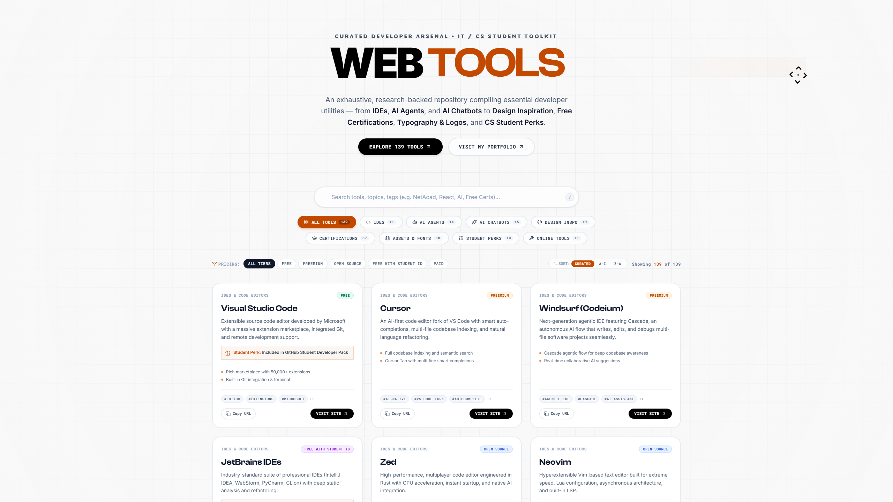
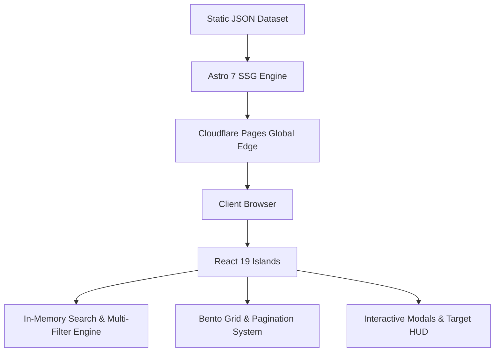

# ⚡ Web-Tools
### Curated Developer Arsenal & Computer Science Student Toolkit

An industry-grade, research-backed directory compiling 139+ essential developer software, frontier AI coding assistants, design inspiration repositories, free verified certification pathways, typography & icon libraries, and high-value student free tiers.

 

 

**[Explore Live Directory](https://web-tools.kidlat.workers.dev/)** • **[Visit Portfolio](https://portfolio.kidlat.workers.dev/)** • **[Report an Issue](https://github.com/kidlatpogi/Web-tools/issues)**

 

  

---

## 🧭 Executive Summary & Vision

Aspiring software engineers, Computer Science undergraduates, and seasoned developers navigate an increasingly fragmented ecosystem. High-value developer tools, free student compute credits, frontier AI coding agents, and accredited certification vouchers are scattered across hundreds of disparate forums, landing pages, and newsletters.

**Web-Tools** solves this discovery problem by providing a unified, lightning-fast, and curated index engineered with uncompromising performance and craft. Every tool in the directory is rigorously vetted for genuine utility, developer ergonomics, educational value, and free-tier transparency.

---

## 🎨 Design System & Aesthetic Heritage

> [!NOTE]
> The visual identity, typography hierarchy, responsive layout patterns, and interactive HUD elements of **Web-Tools** are directly based on and inspired by the creator's portfolio system:
>
> 🌐 **Live Portfolio:** [https://portfolio.kidlat.workers.dev/](https://portfolio.kidlat.workers.dev/)  
> 📦 **Portfolio Repository:** [https://github.com/kidlatpogi/Portfolio](https://github.com/kidlatpogi/Portfolio)
>
> We encourage developers and recruiters to explore the portfolio codebase to see how modular design tokens, canvas backgrounds, and smooth micro-interactions are harmonized across projects.

### Design System Principles
- **Cardinal Red Accent (`#C44900`):** High-energy focal color delivering bold visual hierarchy without sacrificing readability.
- **Display Typography:** Modern typographic pairing combining **Clash Display**, **Array**, and **Geist / Inter** for editorial-grade readability.
- **Interactive Canvas ShapeGrid:** Custom procedural canvas grid with real-time cursor proximity calculations and trail animations.
- **Magnetic HUD Target Cursor:** Smooth hardware-accelerated magnetic cursor tracker adhering to interactive buttons and cards.
- **Bento Grid Architecture:** Clean, modular card layout built with high-contrast borders, subtle glassmorphism (`backdrop-blur`), and responsive flex/grid layouts.

---

## 🚀 Key Capabilities & Highlights

- **⚡ Instant Sub-Millisecond Search:** In-memory, client-side search engine indexing titles, descriptions, categories, student perks, and multi-tier tags without server roundtrips.
- **🎯 Multi-Dimensional Filtering:** Filter simultaneously across 8 specialized domains, 5 pricing tiers (*Free, Freemium, Open Source, Free with Student ID, Paid*), and alphanumeric sorting (*Curated, A–Z, Z–A*).
- **🎓 Student Perk Highlighting:** Dedicated educational callouts for each entry highlighting perks from the GitHub Student Developer Pack, JetBrains Student Licenses, Cloudflare Workers, and Azure credits.
- **📄 Clean Responsive Pagination:** Built-in 12-item pagination system preventing endless scroll fatigue while maintaining smooth auto-scroll on page transitions.
- **📱 Tailored Mobile Ergonomics:** Dedicated 2-column, 4-row category layout on mobile devices (`4 | 4` with full-width Online Tools) ensuring thumb-friendly access.
- **🔍 Deep Detail Drawers & Modals:** Rich modals featuring key capabilities, ecosystem tags, one-click clipboard link sharing, and outbound launch triggers.
- **⌨️ Keyboard First Navigation:** Instant search activation via `/` and modal/filter dismissal via `Esc`.
- **🛡️ Zero Tracking & Privacy-First:** 100% client-side data evaluation with zero telemetry tracking, no cross-site advertising cookies, and complete user privacy.

---

## 📂 Curated Taxonomy & Directory Structure

The directory organizes **139+ developer utilities** across 8 distinct domain classifications:

| Domain | Category ID | Catalog Size | Core Focus & Sample Entries |
| :--- | :--- | :---: | :--- |
| **IDEs & Code Editors** | `ide` | 11 | Modern workstations, AI code editors & IDEs (*Cursor, VS Code, Windsurf, Zed, JetBrains Fleet, Positron, Neovim*) |
| **AI Agents & Assistants** | `ai-agents` | 14 | Autonomous coding agents, terminal agents & full-stack generators (*Claude Code, GitHub Copilot, Manus AI, Bolt.new, v0, Devin*) |
| **AI Chatbots & Models** | `ai-chatbots` | 15 | Frontier conversational models & reasoning engines (*ChatGPT, Claude, Google Gemini, DeepSeek, Perplexity, NotebookLM, Grok*) |
| **Design Inspiration** | `design-inspiration` | 19 | UI design showcases, component ecosystems & UX galleries (*Mobbin, Godly, Shadcn UI, React Bits, Laws of UX, CTA Gallery*) |
| **Free Certifications** | `certifications` | 37 | Verified certificates, accredited courses & roadmaps (*Cisco NetAcad, freeCodeCamp, Harvard CS50, The Odin Project, IBM SkillsBuild*) |
| **Assets, Fonts & Logos** | `typography-assets` | 18 | Open-source typography, SVG brand logos & icon toolkits (*Google Fonts, Fontshare, Fonts In Use, Coolors, SVGL, Lucide, Flaticon*) |
| **Student Perks & Credits** | `student-perks` | 14 | Educational benefits, cloud credits & software licenses (*GitHub Student Pack, Google One, JetBrains Student, Supabase, Netlify*) |
| **Online Tools & Utilities** | `online-tools` | 11 | Essential web utilities, diagramming tools & converters (*iLovePDF, Mermaid AI, Figma, Canva, Draw.io, DevDocs, Regex101, Transform.tools*) |

---

## 🏗️ Technical Architecture & Engineering Decisions

### Architecture Highlights
1. **Astro Islands Architecture:** HTML is statically compiled ahead-of-time (SSG), loading zero unnecessary JavaScript on the initial render. Interactive elements (`ToolDirectory`, `ShapeGrid`, `TargetCursor`) are hydrated as isolated React 19 client islands.
2. **Client-Side In-Memory Engine:** All 139+ tool records are loaded in a lightweight static JSON bundle (<35KB gzipped), enabling <1ms search, filter, and sort operations with zero database latency and zero API cold starts.
3. **Edge Deployment:** Hosted on Cloudflare Pages edge network with worldwide anycast CDN distribution and infinite scale.
4. **Git-as-a-CMS:** Fully auditable, version-controlled dataset with pull request review workflows for community contributions and dataset integrity.

---

## ⚖️ Legal Disclaimer & Privacy Policy

### 1. Trademark & Intellectual Property Attribution
**Web-Tools** is an independent, open-source educational directory and aggregation platform. All product names, trademarks, registered trademarks, logos, brand names, and service marks referenced on this website and repository are the property of their respective owners. Their identification and listing on Web-Tools are strictly for educational, informational, and indexing purposes and do not imply any affiliation, sponsorship, endorsement, or commercial association by the trademark holders.

### 2. Third-Party Content & External Links Disclaimer
We do not own, operate, manage, or host any of the third-party software, cloud platforms, compute providers, or educational certification portals indexed in this directory. All outbound links navigate directly to official external domains. Pricing tiers, student discounts, promotional credits, and feature availabilities are determined independently by respective operators and are subject to change without notice.

### 3. Privacy & Data Collection Statement
Web-Tools is built with a **privacy-first** ethos:
- **Zero Tracking:** We do not collect, track, or store personal identifying information (PII), nor do we sell user data to advertising brokers.
- **Client-Side Processing:** All searches, category filter queries, clipboard operations, and sorting logic execute 100% locally in your browser.
- **No Third-Party Cookies:** We do not deploy third-party advertising or cross-site tracking cookies.

### 4. DMCA & Takedown Requests
If you are a copyright or trademark owner and wish to update, modify, or remove your listing or intellectual property from our public index, please submit an issue directly on our [GitHub repository](https://github.com/kidlatpogi/Web-tools/issues). Inquiries are reviewed and processed promptly.

---

## 👨‍💻 Author & Connect

**Web-Tools** is designed and maintained by **kidlatpogi**.

- 🌐 **Portfolio:** [https://portfolio.kidlat.workers.dev/](https://portfolio.kidlat.workers.dev/)
- 🐙 **GitHub:** [@kidlatpogi](https://github.com/kidlatpogi)
- 💼 **Project Repository:** [https://github.com/kidlatpogi/Web-tools](https://github.com/kidlatpogi/Web-tools)

---

  Built with passion for the global developer and student community. Licensed under the <a href="LICENSE">MIT License</a>.

